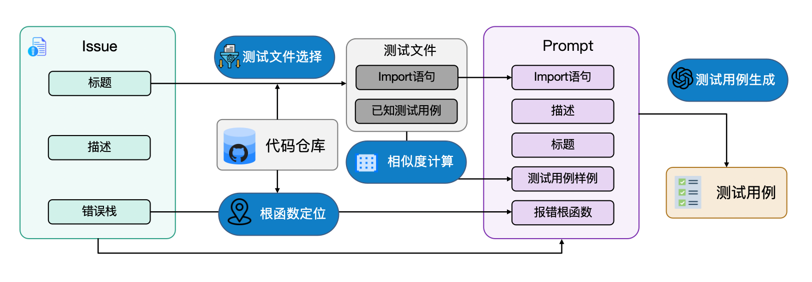

# TestGen4Issue
基于LLM和检索增强的故障复现测试用例生成方法，自动化为GitHub Issue生成故障复现测试用例。

## 方法简介

本工作为基于LLM和检索增强的故障复现测试用例生成方法，如上图所示，输入为一个GitHub Issue及其所在代码仓库，输出为复现Issue内容并验证Issue是否解决的故障复现测试用例。具体而言，本方法主要分为四个步骤：报错根函数定位、测试文件选择与import语句抽取、基于相似度计算的测试用例样本选取，以及最终的故障复现测试用例生成。通过这些步骤，本文方法有效获取了与Issue相关的上下文信息，并将其整合在prompt中，增强了大语言模型在故障复现测试用例生成中的表现。

## Set Up
1. 请在definitions.py文件中修改以下内容：
OPENAI_API_BASE = "YOUR_OPENAI_API_BASE"
OPENAI_API_KEY = "YOUR_OPENAI_API_KEY"

2. 请阅读data/raw_repo_lite文件夹下的readme.txt，克隆SWE-bench_Lite数据集中的12个代码仓库。

## 代码

### 本文工作核心代码
本文工作的核心代码在our_method文件夹下，最主要的代码文件及其解释如下：
1. generate_test.py: 为GitHub Issue生成故障复现测试用例；
2. generate_prompt.py: 各类prompt构建函数；
3. query_gpt.py: 与LLM问答接口
4. retrieve_example_tests.py: 检索测试用例样本的代码；
5. search_test_file.py: 检索与Issue相关的测试文件；
6. search_code.py: 静态分析工具，搜索代码上下文；
7. utils.py: 各类方法接口。

### 对比工作Libro复现代码
对比工作的复现代码在libro文件夹下，最主要的代码文件及其解释如下：
1. generate_test.py: 复现Libro方法，为GitHub Issue生成故障复现测试用例；
2. query_gpt.py: 与LLM问答接口；
3. search_code.py: 静态分析工具，搜索代码上下文。

## 数据
本文工作的实验数据在data文件夹下，包含对比实验和消融实验等，各个子文件夹的解释如下：
1. our_method_result: 本文工作生成的故障复现测试用例；
2. libro_result: 对比工作Libro生成的故障复现测试用例；
3. ablation_result: 消融实验数据；
4. temp_data: 检索增强内容，包含测试文件、import语句、测试用例样本。

# 联系作者
如有任何疑问，欢迎联系我们，邮箱为：wangying22@m.fudan.edu.cn

